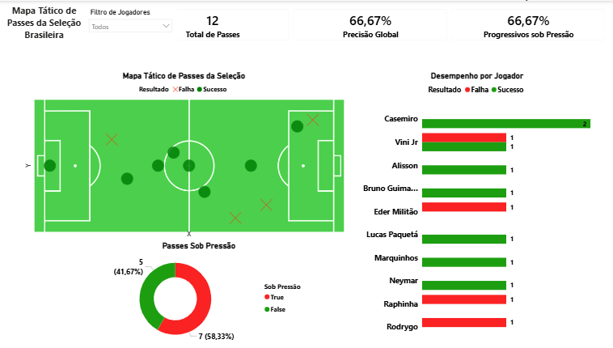

# Sports Analytics: Mapeamento Tático e Event Data

Projeto desenvolvido para demonstrar o ciclo completo de análise de dados no futebol, simulando o ambiente de inteligência e performance (Scouting). 

##  Objetivo
Consumir dados semiestruturados (JSON) no formato de Event Data (padrão Wyscout/Statsbomb), processar via Python e construir um dashboard analítico-espacial interativo no Power BI.

##  Tecnologias Utilizadas
* **Python (Pandas, JSON):** Ingestão, tratamento e estruturação dos dados brutos de eventos de partida.
* **Power BI:** Visualização de dados, mapeamento espacial (coordenadas X e Y) e modelagem.
* **DAX:** Criação de métricas de contexto avançadas (ex: passes progressivos sob pressão).

##  O Dashboard
O painel tático foge das estatísticas básicas (como "precisão global") e foca no contexto da tomada de decisão do atleta em campo. O mapa reproduz com precisão matemática o local exato da ação, permitindo à comissão técnica avaliar o comportamento dos jogadores em zonas críticas.

##  Principais KPIs Criados
* **% de Passes Progressivos sob Pressão:** Mapeia os atletas com maior resiliência e capacidade de quebrar linhas adversárias enquanto são pressionados.

---
*Desenvolvido com foco em lógica de exatas, raciocínio espacial e regras de negócio do futebol moderno.*
